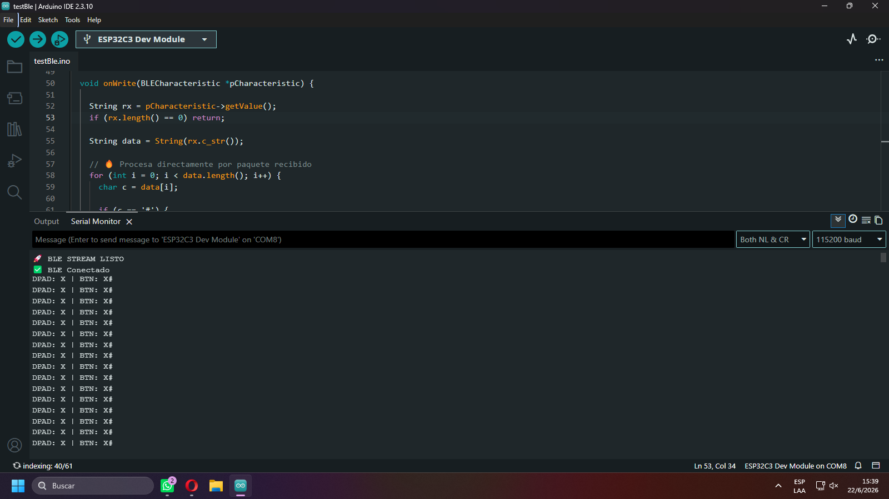
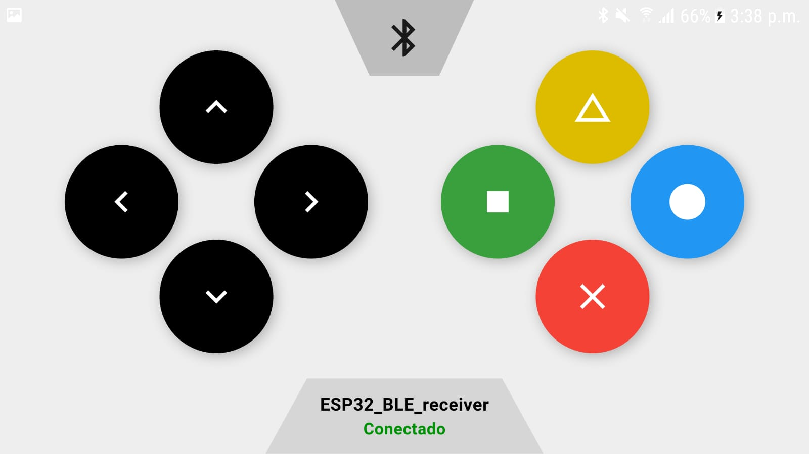

# BLE GAMEPAD CONTROLLER

Proyecto compuesto por dos partes:
- 🧠 Firmware ESP32 (Arduino) para comunicación BLE
- 📱 App Flutter para control remoto vía Bluetooth Low Energy

## 🔧 testBLE (ESP32 - Arduino)

### 📌 Función
Firmware para ESP32 que permite:

- Comunicación BLE
- Recepción de comandos desde la app Flutter
- Control de periféricos (LEDs, servos u otros módulos)

### ⚙️ Requisitos

- Arduino IDE
- Placa ESP32 instalada
- Librerías BLE de ESP32

---

## 📱 ble_controller (Flutter App)

### 📌 Función
Aplicación móvil para:

- Conectar con ESP32 vía Bluetooth BLE
- Enviar comandos en tiempo real
- Interfaz de control personalizada

### ⚙️ Requisitos

- Flutter SDK
- Android Studio SDK
- VS Code
- Dispositivo Android con BLE
